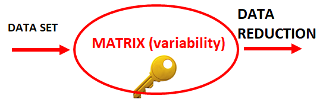
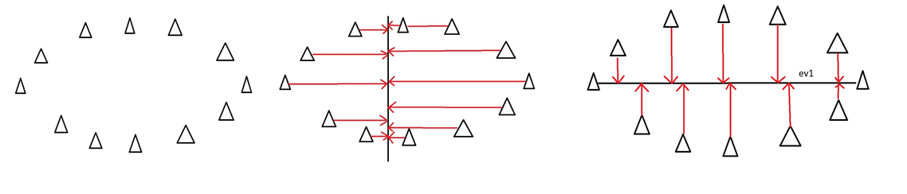

```{r setup, include=FALSE}
knitr::opts_chunk$set(echo = TRUE)
```

# PROCESSING COMPLEX DATA - A START

{width="300"}

# Dimensionality reduction

-   **Data** **Dimensionality** in statistics = many attributes a data
    set has.

-   Example: hospital data

    -   Demographics (age, gender, ethnicity, birth circumstances,..)

    -   Social  characteristics (habitat, poverty index, employment...)

    -   Lifestyle elements (nutrition habits, exercise intake, etc.)

    -   Environmental factors (geographical location)

    -   Disease occurrence, death, etc.

-   These **data** are still structured and could be represented in a
    spreadsheet, with one column representing a **dimension**.

-   **High Dimensional** means that the number of dimensions are very
    high - managing and making sense of them becomes very difficult.

    -   Somewhat counter-intuitive - we always want more data

    -   This is a different setting from that of hypothesis testing and
        sits on the exploratory side of the analytical methodologies

-   **Reduction of dimensionality** means to simplify understanding of
    data, either numerically or visually whilst maintaining its
    integrity.

    -   To reduce dimensionality means combining related data into
        groups through rescaling variables of different magnitudes an
        into fewer components

    -   Throwing away data - not a solution

-   Why do we need to do this?

    -   **The more dimensions you add to a data set**

        -   **the more difficult it becomes to predict certain
            quantities**

        -   the more difficult to visualize

    -   Predictive models - parsimony. That is they should contain a
        minimum number of predictors yet explaining most of the
        variability in the outcome

    -   No matter how complex an epidemiological/biological process
        -only the most important signals in the data can be robustly
        disentangled

-   The number of features can exceed the number of observations.

-   Reducing the complexity to a few dimensions, we can then plot the
    data and untangle its intrinsic characteristics, summarize and learn
    from.

## DIMENSIONALITY REDUCTION - NO CHERRY PICKYNG

{width="150"}

-   What to do about it? Is discarding information a solution?

-   Trade-off between complexity and simplicity

-   Algorithms for extracting  a set of "uncorrelated" principal
    variables and reduce the complexity of the data

-   This is not done either randomly or by "choosing" some of the
    original variables

-   New, "unrelated, uncorrelated" variables as functions of the old
    features are rather constructed.

-   Tools available in R

### Linear algebra - MATRIX reloaded

{width="253"}

-   At the centre of all data simplification procedures - [**A
    MATRIX**]{.ul}

-   A dataset as a spreadsheet can be thought as a matrix with data
    variables as columns -- elements easy to store and access using
    their positions (ROW, COLUMN)

-   BUT -- this is NOT the matrix we refer to

-   A novel associated matrix to the original data based on data
    variability is constructed

-   No scaremongering: R does everything for you!

### **The concept of normalizing or standardizing ONE variable**

-   Data are of various magnitudes (example: age, blood concentrations,
    income, etc.)

-   Let's assume that X is a continuous variable with n observations
    $X=(x_1, x_2, ..., x_n)$

    -   The mean $\mu=\frac{x_1+x_2+ ...+x_n}{n}$

    -   The variance
        $Var(X)=\frac{(x_1-\mu)^2+(x_2-\mu)^2+...+(x_n-\mu)^2}{n-1}$

    -   The $SD=\sqrt{Var(X)}$

    -   $X_{standard}=\frac{(x_1-\mu, x_2-\mu, ..., x_n-\mu)}{SD}$

    -   $x_1\longrightarrow\frac{x_1-\mu}{SD}$ -each components is
        transformed into the number of standard deviations from the mean

### Two or more variables

-   Let's assume that X, Y are continuous denoted by
    $X=(x_1, x_2, ..., x_n)$ and$Y=(y_1, y_2, ..., y_n)$

    -   $Cov(X, Y)=\frac{(x_1-\mu_X)\times(y_1-\mu_Y)+(x_2-\mu_X)\times(y_2-\mu_Y)+...(x_n-\mu_X)\times(y_n-\mu_Y)}{n-1}$
        , $Cov(X, X)=Var(X)$

    -   $Cor(X, Y)=\frac{Cov(X, Y)}{𝑆𝐷(𝑋)\times𝑆𝐷(𝑌)}$ always between
        [0,1] $Cor(X, X)=1$

    -   $\begin{bmatrix} Var(X) & Cov(X, Y) \\ Cov(X, Y) & Var(Y) \\ \end{bmatrix}$
        variance-covariance matrix

    -   $\begin{bmatrix} 1 & Cor(X, Y) \\ Cor(X, Y) & 1 \\ \end{bmatrix}$
        correlation matrix

-   Both matrices ALWAYS square (dimension of the complete data columns)
    and symmetric. They are denoted by S (variance) and R (correlation)
    in the code below

-   Given a dataset, it is [***these two matrices***]{.ul} containing
    the variability in the data which play a central role in data
    dimensionality reduction

    {width="335"}

## Principal Component Analysis - an informal explanation

-   PCA is a meaningful name: finds the principal components of the data

-   PCA -- the components explaining most of the variability in the
    data - relies on fairly hard core mathematics - matrices operations.
    All done by R!

-   Involves paired concepts such as

    -   [***eigenvector***]{.ul} - a direction

    -   [***eigenvalue***]{.ul} - a number quantifying how much variance
        there is in the data in its corresponding eigenvector direction

    -   Concepts associated to a square matrix and hence to the
        variability matrix

-   Principal components

    -   The underlying structure of the data

    -   The directions of largest variance

-   They are automatically done in R - inbuilt functions

    

## PCA -Variability processing of the data

-   A dimension-reduction tool that can be used to reduce a large set of
    variables to a small set that still contains most of the information
    initially contained in the large set.

-   A mathematical procedure that [***transforms a number of (possibly)
    correlated variables***]{.ul} into a (smaller) number of
    [***uncorrelated variables***]{.ul} called [***principal
    components.***]{.ul}

-   **Algorithm:** The first principal component [***accounts for as
    much of the variability***]{.ul} in the data as possible, and **each
    succeeding component accounts for as much of the remaining
    variability** as possible.

## PCA EXAMPLES IN R

### SIMULATED DATA EXAMPLE

-   This routine

    -   builds a matrix in R,

    -   simulate a normal distribution and

    -   a bivariate normal distribution.

-   The simulated data would consist of the components of the bivariate
    distribution, i.e. two continuous variables relatively highly
    correlated.

```{r }
 
## The matrix below is required to specify the multivariate normal distribution
Sigma<-matrix(c(20,3,3,1),2,2) 
Sigma

## set the same seed for the simulations to obtain similar numbers
set.seed(54321)

##generate/simulate a normal distribution with mean 20 and standard deviation=5)
norm <- rnorm(1000, 20, 5)
sum<-summary(norm)
sum
sd(norm)
hist(norm)
 
#Generate two variables sampled from a bivariate normal distribution with means 50 and 10, variances 10 and 2 and 
#correlation 0.67 which is calculated from the simulated data)
sim.data <- mvrnorm(n=100, mu = c(50,10), Sigma =  matrix(c(10,3,3,2),2,2), empirical = T)

##store the data in an object
sim.data <- data.frame(sim.data)
##visualize the data frame
sim.data

##correlation - calculate
cor(sim.data$X1 ,sim.data$X2 , method = c("pearson"))

##visualize the bivariate distribution

# Calculate kernel density estimate
bivn.kde <- kde2d(sim.data[,1], sim.data[,2], n = 50)   # from MASS package

# Contour plot overlayed on heat map image of results - a plane representation of what is actually a Mexican hat 
image(bivn.kde)       # from base graphics package
contour(bivn.kde, add = TRUE)     # from base graphics package

```

-   We use these data to exemplify the two directions of variability
    spread. This routine produces and plots the two directions which
    indicate the spread of the data (eigenvalues)

```{r }
#2-dimensional plot of the data
names(sim.data)
sim.data
#Create scatter plot of variable 1 vs. variable 2
plot(scale(sim.data$X1, scale= TRUE), scale(sim.data$X2, scale = TRUE), ylab = "Var2", xlab = "Var1", asp = 1, cex.lab=1.5, cex.axis = 1.5)


#Plot the eigenvectors of the correlation matrix of var1 and var2, showing the direction of the largest and second largest variance
#Create them
vecs <- eigen(cor(sim.data[,1:2]))$vectors
vals <- eigen(cor(sim.data[,1:2]))$values

#the eigenvectors
vals 


##create arrows to show the directions of the eigenvectors
arrows(0,0, sqrt(vals[1])*vecs[1,1], sqrt(vals[1])*vecs[2,1], length = 0.1, lwd = 2, col = "red")
arrows(0,0, sqrt(vals[2])*vecs[1,2], sqrt(vals[2])*vecs[2,2], length = 0.1, lwd = 2, col = "blue")
```

-   This routine shows how much of the variability in the data is
    represented in PCA components

```{r }
#Perform PCA on the two variables based on correlation (scale. = TRUE)
pca.v12 <- prcomp(sim.data[,1:2])
summary(pca.v12)
#Plot scores on PC1 vs. PC2
plot(pca.v12$x[,1], pca.v12$x[,2], xlab = "PC1 (91.7%)", ylab = "PC2 (8.3%)", ylim = c(-1.5,1.5), cex.lab=1.4, cex.axis=1.4)

plot(pca.v12) ##visualize PC loadings as bars
plot(pca.v12,type="lines") ## different way of visualizing

```

-   We add more variables to the data and re-run the PCA analysis

```{r }

#Generate additional two variables sampled from a bivariate normal distribution with means 110 and 135, variances 20 and 33 and correlation 0.856
sim.data1 <- mvrnorm(n=100, mu = c(110,135), Sigma =  matrix(c(20,22,22,33),2,2), empirical = T)
sim.data1 <- data.frame(sim.data1)

#Add the additional two variables to the first two in one data frame
sim.data$X3 <- sim.data1$X1
sim.data$X4 <- sim.data1$X2
sim.data

#Perform PCA on the small data set using the prcomp function based on the standardized data matrix (correlation and not covariance)

pca.data <- prcomp(sim.data, scale. = TRUE)
pca.data
#Create a Scree plot and Horn's parallel analysis to decide how many components to retain
plot(c(1,2,3,4), pca.data$sdev^2, ylab = "Eigenvalue", xlab = "Principal component", type = "o", lwd = 1.5, pch = 16, col = "blue", xaxt = "n", xlim = c(0.8, 4.2), ylim = c(0, 2), cex.lab=1.3, cex.axis=1.3)
axis(1, at=c(1,2,3,4), labels=c(1,2,3,4), cex.lab=1.3, cex.axis=1.3)
```

### REAL DATA EXAMPLE

Parkinson's disease case study variables -- a series of highly
correlated brain measurements

-   **Top of SN Voxel Intensity Ratio** - obtained by averaging five
    random points, taken from the left side within the axial slice, from
    the nigrosome-1 region. Five random points from the ventral medial
    portion of the substantia nigra (a layer of deeply pigmented grey
    matter situated in the midbrain and containing the cell bodies of a
    tract of dopamine-producing nerve cells whose secretion tends to be
    deficient in Parkinson's disease) within the slice of interest are
    averaged. The mean for the nigrosome-1 was divided over the mean for
    the other ROI's to generate the Top of SN Voxel Intensity ratios
    both on the left and right side.

-   **Side of SN Voxel Intensity Ratio -** obtained by averaging five
    random points, taken from the left side within the axial slice, from
    the nigrosome-1 region. Again, five random points from the outer
    swallow tail of the substantia nigra within the slice of interest
    are averaged on the left and right side

-   **The Movement Disorder Society (MDS)-Unified Parkinson's Disease
    Rating Scale (MDS-UPDRS) includes**

    -   Part I (Non-motor Experiences of Daily Living);

    -   Part II (Motor Experiences of Daily Living);

    -   Part III (Motor Examination);

    -   Part IV (Motor Complications) which was excluded as it was only
        conducted for PPMI subjects who had started PD medication.

        ### DATA SUMMARY

-   Read in the data, summary the variables

```{r }
#Read the data
pd_data<-read.table("ParkinsonProgressionMarkers.txt",  sep="\t", header=TRUE)
## display the first 10 lines for a flavour
pd_data[1:10, ] ##show the first 10 lines
dim(pd_data)
names(pd_data)
summary(pd_data)	
```

-   Calculate the variance covariance matrix associated with these data

```{r }

##Find the covariance matrix S of the data. The id column is obviously not included.
S <- cov(pd_data[,2:7])
##display S
S
```

-   Calculate and display the eigenvalues and the eigenvectors

```{r }
##The total variance is equal to the sum of the eigenvalues of S.
sum(diag(S))

##Compute the eigenvalues and corresponding eigenvectors of S.
s.eigen <- eigen(S)
s.eigen
```

-   The eigenvectors represent the principal components of S. The
    eigenvalues of S are used to find the proportion of the total
    variance explained by the components.

```{r }
##The eigenvectors represent the principal components of S. The eigenvalues of S are used to find the proportion of the total variance explained by the components.
for (s in s.eigen$values) {
  print(s / sum(s.eigen$values))
}

plot(s.eigen$values, xlab = 'Eigenvalue Number', ylab = 'Eigenvalue Size', main = 'Scree Graph')
lines(s.eigen$values)
```

-   The elements of the eigenvectors of S are the 'coefficients' or
    'loadings' of the principal components.

```{r }
##The elements of the eigenvectors of S are the 'coefficients' or 'loadings' of the principal components.
s.eigen$vectors
```

-   The first two principal components are thus a linear combination of
    these loadings (or weights).

$z_1=a^′_1y=−.007y_1-.006y_2 +0.080y_3+0.230_y4+0.282_y5+0.928y_6$
$z_2=a^′_2y=−.018y_1+.0006y_2+0.060y_3+0.281y_4−0.893y_5−0.346y_6$

```{r }
pd_data.pca <- prcomp(pd_data[,2:7])
pd_data.pca

##The summary method of prcomp() also outputs the proportion of variance explained by the components.
summary(pd_data.pca)

screeplot(pd_data.pca)
screeplot(pd_data.pca, type="lines")
```

-   Interpretation: most of the variability in the data (almost 95%) is
    explained by the first two components.

### SAME AS ABOVE BUT CALCULATE THE CORRELATION MATRIX

-   If the units of measurements are greatly different the correlation
    matrix is recommended

```{r }
R <- cor(pd_data[,2:7])
R
```

```{r }
##Find the eigenvalues and eigenvectors of the R matrix.
r.eigen <- eigen(R)

##As with the covariance matrix, we can compute the proportion of total variance explained by the eigenvalues.

for (r in r.eigen$values) {
  print(r / sum(r.eigen$values)) 
}
```

-   What is readily noticeable is the first eigenvalue accounts for 53%
    of total variance compared with 87% of the variance of the S matrix.
    The first two components of R only account for 73% of total variance
    while the last two components have little significance. Thus, one
    may want to keep the first four components rather than the first two
    with the S matrix.

```{r }
##To perform principal component analysis using the correlation matrix using the prcomp() function, set the scale argument to TRUE. The default is false

pd_data.pca.scaled <- prcomp(pd_data[,2:7], scale = TRUE)
pd_data.pca.scaled

summary(pd_data.pca.scaled)
```

-   Interpretation of principal components is still a heavily researched
    topic in statistics, and although the components may be readily
    interpreted in most settings, this is not always the case

-   One method of interpretation of the principal components is to
    calculate the correlation between the original data and each
    component.

-   The PCs can then be interpreted based on which variables they are
    most correlated in either a positive or negative direction. The
    level at which the correlations are significant is left to the
    researcher. In other words depends on the research field.

## PCA WRAP UP

-   Multivariate Analyses often starts out with data involving a
    substantial number of correlated variables.

-   Only applicable to a range of continuous variables: it involves
    concepts such variances, covariances, correlations only applicable
    to continuous data

-   (PCA) is a dimension-reduction tool that can be used to reduce a
    large set of variables to a small set that still contains most of
    the information in the large set.

-   Principal component analysis (PCA) is a mathematical procedure that
    transforms a number of (possibly) correlated variables into a
    (smaller) number of uncorrelated variables called principal
    components.

-   The first principal component accounts for as much of the
    variability in the data as possible, and each succeeding component
    accounts for as much of the remaining variability as possible.

-   However, [***PCA does not have inferential value***]{.ul}:

    -   There is no p-value associated as there is no test.

    -   It based on algebra rather than probabilities.

    -   The concept does not involve dependent/response/statistical
        outcome

    -   A method to find out where the variability in the data lies

    -   Exploring large data, digging large data

-   [***The confirmatory part of a research starts after PCA***]{.ul} -
    understanding whether newly derived uncorrelated variables associate
    with an outcome
